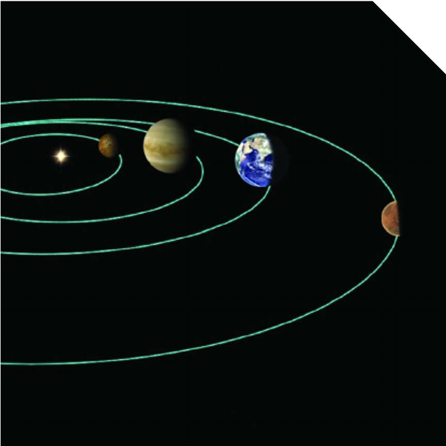
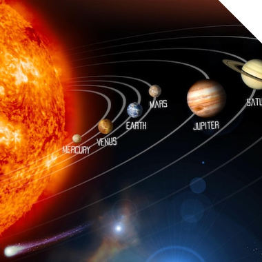
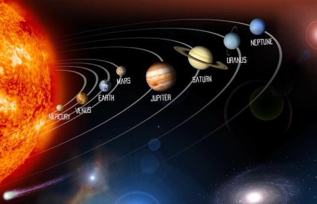

<!--
_class: slide-first
_paginate: skip
_header: ''
-->
## Ch.24
# EARTH AND THE SOLAR SYSTEM

---

<!-- class: slide-main -->
# Solar system
- Planet
- Minor planet
- Asteroids and meteoroids
- Comets

---

# Planet
1) 8 planets
2) Inner
3) Outer

---

---

<!--
_class: slide-end
_header: ''
_paginate: skip
-->
# Thanks you
